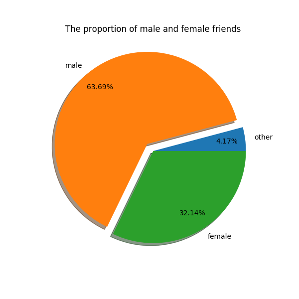
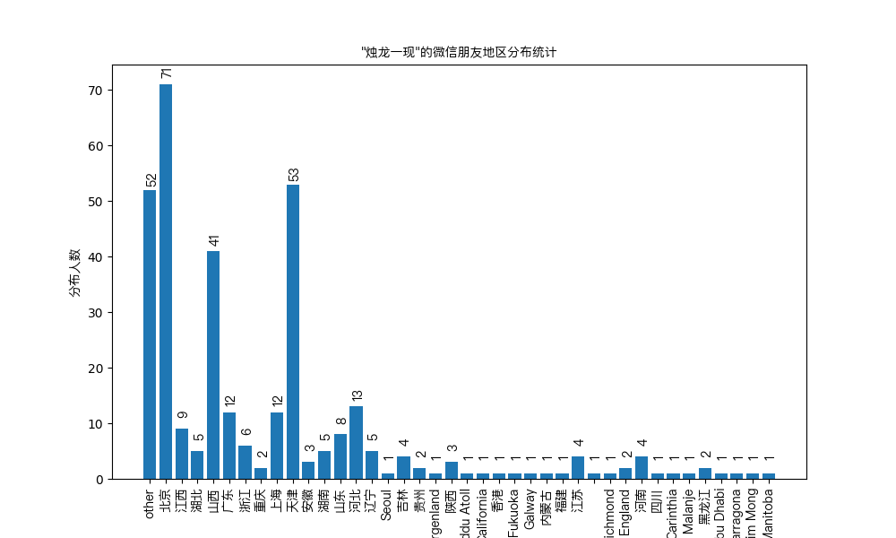

# 微信个人数据分析脚本

使用`python3`，需要安装模块`wxpy`和`matplotlib`

```
$ pip3 install wxpy matplotlib
```

其中`matplotlib`默认不支持中文，需要配置一下中文字体：

```
cnFont = FontProperties(fname='/System/Library/Fonts/PingFang.ttc')
```

上面的路径是`MacOS`下的中文字体路径，其它平台需要自行配置


# 目前功能

1. 分析朋友圈的男女比例，并发送图片到微信文件小助手



2. 分析朋友圈城市分布，并发送条形图到微信文件小助手



3. 分析朋友圈个性签名，并生成词云图发送到微信小助手


